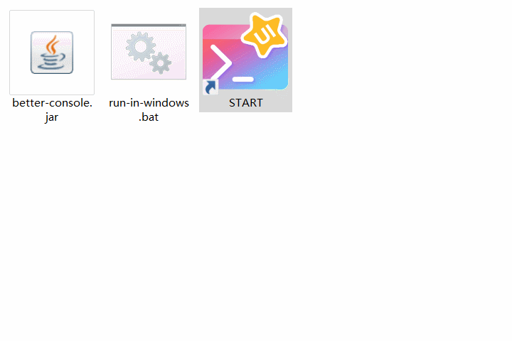

# better-console

“更好的控制台”

### 介绍

这是一款用于**在控制台中构建图形用户界面**的框架。它**完全基于 Java SE 构建**，并提供了一套**声明式的、组件化的编程模型**，帮助你高效地开发用户界面。

如果你正在学习 Java SE ，阅读本框架源代码应该可以辅助你学习与实践有关面向对象、封装继承多态、设计模式、集合、泛型、IO流、线程、流API、函数式接口等知识点。

**效果展示：**

### 特色

- **无任何第三方依赖**，所有功能完全内置实现，开箱即用！
- **上手几乎没有任何门槛**，甚至如果你正是一位刚刚开始学习 Java SE 的新手，这个框架有助于逐渐提升你对整套 Java SE 的理解！
- **声明式编程范式**：它关注于描述 “做什么” 而非 “怎么做” 。在声明式编程模型中，你表述程序的逻辑，而不必详细说明其控制流和状态管理！
- **组件化编程范式**：它强调将软件系统分解为独立的、可复用的模块（即组件）。每个组件封装了特定的功能或逻辑，具有明确的接口和依赖关系，可以在不同的上下文中独立使用和组合！
- **渐进式框架**：它允许开发者按需采用框架的各个特性，从而逐步增加应用程序的复杂性和功能。本框架可以在你几乎不需要修改项目源代码的情况下，直接给项目中需要展示的任何内容按你所想显示到控制台中，可拓展、灵活、易用、模块化、适应性强！

### 开始使用

具体使用说明请移步 [Better Console 官方文档](https://lhlnb.top/bconsole-docs/)

### 技术栈

- Better Console - Java
- Document - VuePress

### 开源协议

GNU General Public License v3.0