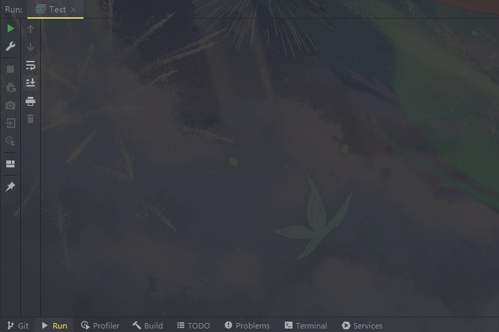
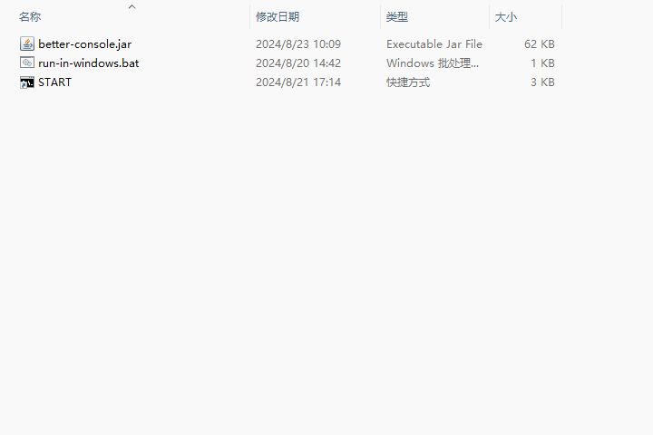
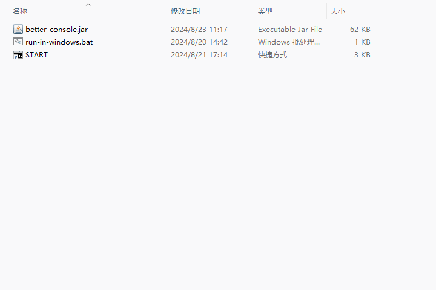
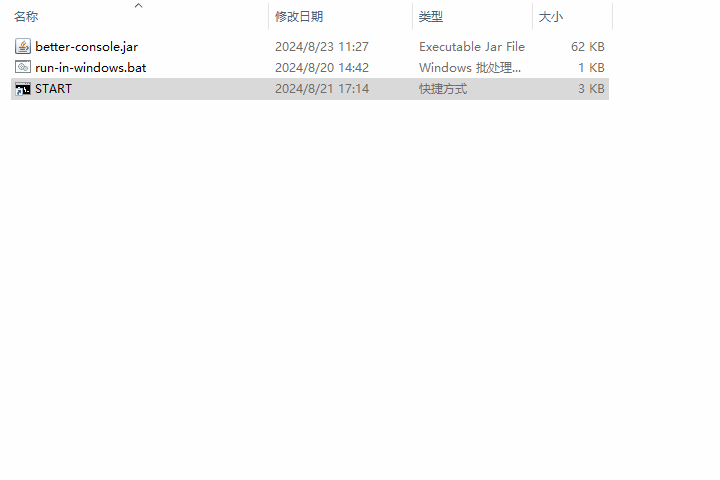

# Better Console Document

> “更好的控制台” —— 使用说明文档

## 一、开 始 🎉

### 1.1 介 绍

####  🔔 前 言

控制台一般指的是一个程序与使用者交互的工具，它还有一个名字叫做“终端”，普遍是以纯文本流输入输出的形式进行工作。通常情况下，一个程序要使用控制台与用户交互信息，都是“你输入一行，我打(print)一行”，使用体验极其糟糕！作为程序开发者，如果想展示的数据过于复杂、动态、结构化，光使用控制台的解决方案只会徒增工作量，费力不讨好，但是对于小型的工具类程序、测试程序、以及一些新手开发者来说，专门为此开发图形用户界面并不是一个低成本且轻而易举的选择，回想一下，你有多少有趣的小作品因为人机交互不够优雅而胎死腹中了呢，现在，你可以有一个新的选择！

**正如我的名字所述：“Better Console”，直译为“更好的控制台”，简称为 BConsole。**

BConsole 是一款用于**在控制台中构建图形用户界面**的框架。它**完全基于 Java SE 构建**，并提供了一套**声明式的、组件化的编程模型**，帮助你高效地开发用户界面。无论是简单还是复杂的界面，BConsole 都可以胜任，丢掉你的 `System.out.println("");` 吧！

#### ✨ 特 色

- **BConsole 没有使用任何第三方依赖**，所有功能完全内置实现，开箱即用！
- **上手几乎没有任何门槛**，甚至如果你正是一位刚刚开始学习 Java SE 的新手，这个框架有助于逐渐提升你对整套 Java SE 的理解！
- **声明式编程范式**：它关注于描述 “做什么” 而非 “怎么做” 。在声明式编程模型中，你表述程序的逻辑，而不必详细说明其控制流和状态管理！
- **组件化编程范式**：它强调将软件系统分解为独立的、可复用的模块（即组件）。每个组件封装了特定的功能或逻辑，具有明确的接口和依赖关系，可以在不同的上下文中独立使用和组合！
- **渐进式框架**：它允许开发者按需采用框架的各个特性，从而逐步增加应用程序的复杂性和功能。BConsole 可以在你几乎不需要修改项目源代码的情况下，直接给项目中需要展示的任何内容按你所想显示到控制台中，可拓展、灵活、易用、模块化、适应性强！

> 说到这里，相信你已经想起了一位故人：Vue，不认识它也没什么关系，没错，本框架的开发大量学习了 Vue 的思想

### 1.2 快速上手 👨‍💻

#### 前置条件

1. 只要你会使用 Java 打印 Hello World，那么应该就可以玩儿转本框架去显示各种有意思的内容
2. 你的电脑上正确安装了 JDK（推荐版本 17），以及对应集成开发环境（推荐IntelliJ IDEA）

#### 引入 BConsole 

> 方式多种多样，选择最适合你的一种即可~

- IDEA 手动导入 Jar 包依赖
  - 步骤……（还没写）
- 使用 maven 引入
  - 步骤……（还没写）
- 直接下载源代码将对应类复制到自己的项目目录下
  - 步骤……（还没写）

#### 创建第一个基于 BConsole 驱动的小程序

在本节中，我们来试着在自己电脑上把黑不溜秋的控制台变成一个酷炫的屏幕时钟吧

> **</>** 代码示例

```java
public class Test {
    public static void main(String[] args) throws InterruptedException {
        // 启用控制台显示屏，并显示一个数字时钟
        BConsole.getScreen().reg(PresetViews.getClockView()).turnON();
        // 等待一分钟后
        Thread.sleep(60 * 1000);
        // 关闭控制台显示屏，退出程序
        BConsole.getScreen().turnOFF();
    }
}
```

🟢 让我们运行它！



**（这里放图，还没写）**

什么？控制台为什么在循环打印奇奇怪怪的东西？这是正确的吗？

原来，我们能在控制台上看到的文本内容都是程序“流式输出”的，你现在不懂也无妨，你只需要知道这些内容一旦被打印，他就会被永远记录在控制台上，一般情况下会直到这个终端会话结束。

> KNOWLEDGE CARD
>
> **流式输出**（Stream Output）
>
> 一种计算机输出数据的方式，数据被连续发送至输出设备（如控制台、文件、网络等），而不需要等待所有数据都准备好才进行输出。这种方式特别适用于数据量大或者实时性要求高的场景，如实时日志系统、视频流处理或实时数据传输。
>
> 知识点来自：Java I/O 流 `package java.io`

对于简单的文本输出，这可能不是问题，但如果我们希望实现更动态的效果，比如一个实时更新的时钟，单纯的流式输出就可能导致输出内容杂乱无章。因此，我们需要一种方式来刷新已有的输出，以保持屏幕内容的整洁和组织性。

这正是为什么在开发类似应用时，我们常常需要在命令行界面（CMD）中运行程序，因为它允许我们利用特定的命令来清除或更新控制台的输出内容。例如，我们可以使用 `cls` 命令在Windows的CMD中清屏，或是在UNIX系统（包括Linux和MacOS）中使用 `clear` 命令。

还记得学习使用IDE开发 Java 之前，你是如何运行 Java 程序的吗？

没错，还是那个CMD！(Windows)，基于 Java 跨平台的特性，无论你使用什么平台，你只需要把你的 Java 代码编译成 Jar 包，再使用系统控制台运行这个 Jar 包就行了。

为了方便后续测试，你可以在你的 Jar 包目录下新建一个 `start.bat` 文本文件，并填入以下内容：

```bash
echo off
title BConsole Test
# 注意把 your_jar_name.jar 替换成你实际的Jar包名字
java -jar -DfileEncoding=UTF-8 your_jar_name.jar
pause
```

这样一来，以后我们打算测试程序的时候，编译好后直接双击这个 `start.bat` 批处理文件就可以运行程序了。

🟢 现在让我们再次运行它！



恭喜，现在你已经成功使用 BConsole 完成了一个酷炫的屏幕时钟！在后续章节中，我们将逐步开始学习 BConsole 的各种使用方式与运行机制。

> KNOWLEDGE CARD
>
> **如何使用 IDEA 编译 Jar 包**
>
> ###### 1. 配置项目的主类
>
> 在打包之前，确保你的项目已经设置了正确的主类（即包含 `main` 方法的类）。
>
> 1. 打开项目。
> 2. 进入到 **File** > **Project Structure**（或者使用快捷键 `Ctrl+Alt+Shift+S`）。
> 3. 在打开的窗口中选择 **Modules** 下的 **Sources** 选项卡。
> 4. 确保你的源代码文件夹被标记为 **Sources**，并且资源文件夹（如 `res` 或 `resources`）被标记为 **Resources**。
> 5. 点击 **Artifacts** 选项。
> 6. 点击左上角的 `+` 按钮，选择 **JAR** > **From modules with dependencies...**。
>
> ###### 2. 设置 JAR 包构建选项
>
> 1. 在 **Main Class** 字段中选择你的应用程序入口点类（主类）。
> 2. 确定提取到 JAR 的库处理方式。常用的选项是 **extract to the target JAR**（将依赖库解压到目标 JAR 中），这样做可以确保所有依赖都包含在一个 JAR 文件内。
> 3. 调整其它选项如需要（例如包含 JavaFX 应用时的特殊处理）。
> 4. 点击 **OK** 保存你的设置。
>
> ###### 3. 构建 JAR 文件
>
> 1. 打开 **Build** 菜单。
> 2. 选择 **Build Artifacts...**。
> 3. 选择你刚配置的 Artifact。
> 4. 点击 **Build**。
>
> ###### 4. 运行打包的 JAR 文件
>
> 在成功构建 JAR 文件后，你可以在命令行中使用 `java -jar` 命令来运行它：
>
> ```bash
> java -jar path/to/your_jar_file.jar
> ```
>
> 确保 Java 运行时环境已经安装，并且版本与你的项目兼容。

## 二、基 础

### 2.1 BConsole 屏幕控制器

相信你已经发现了 BConsole 把控制台变身为 "UI" 的原理，其实就是把一些基础的文本内容按照你想要的方式排版组织，最后拼凑成一个大字符串，然后直接打印到控制台里，那么如何管理 BConsole 在控制台的输出行为呢？

在 `class BConsole` 中提供了一个静态方法：

> **</>** 获取单例的屏幕对象

```java
public static BConsole getScreen()
```

你可以在任何地方调用这个方法去获取控制台的屏幕操控对象，这个对象是懒汉式单例模式的，因此你无需担心代码中多次使用这个方法会造成控制台混乱输出的问题！

有了屏幕控制器 `screen` 之后，你就可以通过它提供的实例方法来管理你的控制台了。

（你可以想象成电视遥控器可以控制电视机的各种行为，比如开关、音量调节等，这些都是电视机自身的设置，你无法通过电视遥控器来让本该去抓光头强砍树的熊大熊二跑到灰太狼家里去救懒羊羊，如果你需要管理屏幕上显示的内容，显然不应该在这里研究）

### 2.2 启用和停止控制台输出

为了保证数据的实时性，控制台里的这些字符也面临着不断地清空和打印，显然在这个期间，如果还有其他程序在控制台打印内容，就不仅会导致当前显示错乱，而且在下一轮数据刷新的时候这些内容也会随之消失，因此你需要根据你的需要来控制 BConsole 什么时候去接管控制台。

**screen 实例方法**

> **</>** 启用控制台输出

```java
public void turnON()
```

> **</>** 停止控制台输出

```java
public void turnOFF()
```

当你启用了控制台输出，那么 BConsole 就会按照你对它的配置去接管控制台，在此期间如果发生了其他程序使用 `System.out.println("");` 等打印信息的行为、或者抛出异常的行为时，**这些信息并不会干扰 BConsole 在屏幕上渲染内容**，因为一旦调用了 `screen.turnON()` 方法后，BConsole 就会立即劫持系统的标准输出流，直到你使用 `screen.turnOFF()` 方法结束控制台输出为止！

让我们来试试看！

> **</>** 代码示例

```java
public class Test {
    public static void main(String[] args) throws InterruptedException {
        // 拿到屏幕控制器
        BConsole screen = BConsole.getScreen();
        // 启用控制台显示屏
        screen.turnON();
        // 等待3秒后
        Thread.sleep(3 * 1000);
        // 关闭控制台显示屏，退出程序
        screen.turnOFF();
    }
}
```

🟢 让我们运行它！



### 2.3 在屏幕上输出内容

在启用 `screen` 往控制台上输出内容前，你肯定需要告诉它你要输出什么内容，因此我们要先来认识一个用于承载文本内容的类与对象：`CompText`

> **</>** 使用CompText来存储文本内容

```java
CompText text = new CompText("Hello BConsole!\n你好，更好的控制台！");
```

这样一来，`text` 这个 `CompText` 类型的变量就保存了如下的文本内容：

```
Hello BConsole!
你好，更好的控制台！
```

接下来，你需要让 `screen` 来显示你的内容，这个操作叫做 “注册（register）”

> **</>** 向 `screen` 注册要显示的内容

```java
screen.reg(text);
```

然后就可以启用控制台输出看看效果了

> **</>** 代码示例

```java
public class Test {
    public static void main(String[] args) throws InterruptedException {
        // 拿到屏幕控制器
        BConsole screen = BConsole.getScreen();
        // 使用 CompText 存储文本内容
        CompText text = new CompText("Hello BConsole!\n你好，更好的控制台！");
        // 注册文本内容到屏幕
        screen.reg(text);
        // 启用控制台显示屏
        screen.turnON();
        // 等待3秒后
        Thread.sleep(3 * 1000);
        // 关闭控制台显示屏，退出程序
        screen.turnOFF();
    }
}
```

🟢 让我们运行它！



### 2.4 响应式系统

如果只是为了显示静态文本内容，显然没必要大费周章去使用这个框架，**BConsole 拥有一套单向响应式系统，当一个变量发生了更改，BConsole 就能在下一次屏幕渲染时拿到这个变量的最新值并且把它输出到屏幕上！**

还记得刚开始学习使用 Java 打印 “Hello World” 时学过的 `System.out.println()` 方法吗，它还有一个亲兄弟： `System.out.printf()` ，相信用过的朋友都知道，如果要输出的是一个长字符串，并且里面有很多变量的时候，使用 `字符串 + 变量 + 字符串 ... ` 的方式拼接会非常繁琐，因此我们会使用 `printf()` 来格式化输出：

> **</>** println() 与 printf()

```java
String name = "张三";
int age = 5;
System.out.println("我叫" + name + "，今年" + age + "岁了！"); // 传统字符串拼接输出
System.out.printf("我叫%s，今年%d岁了！%n", name, age); // 格式化输出
```

在 `printf()` 中有许多格式化符号，常见的有：

- `%d` 用于整数
- `%f` 用于浮点数
- `%s` 用于字符串
- `%n` 表示换行

而在 BConsole 当中，也有一套类似的机制，不过我们并没有那么多符号，当你需要插入某个变量的时候，你只需要使用魔法变量 `$v$` 来占位，然后使用 `ref()` 方法给这些魔法变量对应地绑定变量，BConsole 会在未来渲染的时候去找到这个变量的最新值

 **`ref()` 的语法格式为：** `要绑定变量的对象.ref(v -> v.bind(对应的变量, 可变参数, 按照顺序填写, ...))`

> **</>** 将上面的例子改用 BConsole 来输出

```java
public class Test {
    public static void main(String[] args) throws InterruptedException {
        // 拿到屏幕控制器
        BConsole screen = BConsole.getScreen();
        // 使用 CompText 存储带变量的文本内容
        CompText text = new CompText("我叫$v$, 今年$v$岁了！");
        String name = "张三";
        int age = 5;
        // 绑定变量
        text.ref(v -> v.bind(name, age));
        // 注册文本内容到屏幕
        screen.reg(text);
        // 启用控制台显示屏
        screen.turnON();
        // 等待3秒后
        Thread.sleep(3 * 1000);
        // 关闭控制台显示屏，退出程序
        screen.turnOFF();
    }
}
```

🟢 让我们运行它！


既然 BConsole 是具备单向响应式能力的，那我们不妨让里面的变量动起来！

> **</>** 让张三每隔 2 秒就长大一岁，长大到 8 岁就改名叫张老三

```java
public class Test {
    public static void main(String[] args) throws InterruptedException {
        // 拿到屏幕控制器
        BConsole screen = BConsole.getScreen();
        // 使用 CompText 存储带变量的文本内容
        CompText text = new CompText("我叫$v$, 今年$v$岁了！");
        String name = "张三";
        int age = 5;
        // 绑定变量
        text.ref(v -> v.bind(name, age));
        // 注册文本内容到屏幕
        screen.reg(text);
        // 启用控制台显示屏
        screen.turnON();
        // 让张三每隔 2 秒就长大一岁，长大到 8 岁就改名叫张老三
        do {
            Thread.sleep(2 * 1000);
        } while (++age < 8);
        name = "张老三";
        // 等待3秒后
        Thread.sleep(3 * 1000);
        // 关闭控制台显示屏，退出程序
        screen.turnOFF();
    }
}
```

🟢 让我们运行它！

```
Test.java:21:30
java: 从lambda 表达式引用的本地变量必须是最终变量或实际上的最终变量
```

发现程序在编译时报错，Lambda 表达式是在 JDK8 之后引入的新特性，原来在 Java 中，Lambda 表达式引用的局部变量必须是 `final` 或 `effectively final` 的，换句话来说，你必须保证这个变量是有效"final"的，解决这个问题非常简单，就是给这些变量进行一层封装，比如用数组或是容器类，他们的引用是 `final` 的，他们的内容修改了，自身的引用地址并没有修改。但是仔细想想我们的需求，要绑定的变量都是会在未来变更的值，如果你在绑定变量的域定义了变量，就算他们是引用类型，不在此作用域的代码是拿不到这些变量的，并不方便在后期进行更改，尤其是如果是多线程情况下对各类数据进行实时统计，因此，一个好的建议就是使用类变量，类变量是有效"final"的，并且为了能随时随地使用和更改这些变量，我们希望这些变量都是静态变量，这样无论程序执行到何处，都一定可以通过类名访问到同一个变量，在 Lambda 表达式内部亦是如此。

**因此，在使用 `ref()` 绑定变量时，该变量必须是可访问的 <span style="color: red;">静态变量 (static) </span>！**

> **</>** 完善上面的代码

```java
public class Test {
    
    static String name;  // 静态变量
    static int age;  // 静态变量

    public static void main(String[] args) throws InterruptedException {
        // 拿到屏幕控制器
        BConsole screen = BConsole.getScreen();
        // 使用 CompText 存储带变量的文本内容
        CompText text = new CompText("我叫$v$, 今年$v$岁了！");
        name = "张三";
        age = 5;
        // 绑定变量
        text.ref(v -> v.bind(name, age));
        // 注册文本内容到屏幕
        screen.reg(text);
        // 启用控制台显示屏
        screen.turnON();
        // 让张三每隔 2 秒就长大一岁，长大到 8 岁就改名叫张老三
        do {
            Thread.sleep(2 * 1000);
        } while (++age < 8);
        name = "张老三";
        // 等待3秒后
        Thread.sleep(3 * 1000);
        // 关闭控制台显示屏，退出程序
        screen.turnOFF();
    }
}
```

🟢 让我们再次运行它！


### 2.X 组件基础


## 三、深入组件

### 3.1 Comp - 根组件


### 3.2 内置组件

- **文本** CompText 
- **艺术字** CompArtText
- **块** CompBlock 
- **水平线** CompHr
- **进度条** CompBar
- **表格** CompTable
- **视图** CompView

### 3.3 预设视图

- **屏幕时钟** clockView
- **系统输出** stdOutView
- **系统信息** sysInfoView

### 3.3 自定义组件


## 四、路 由

## 五、渲染机制
